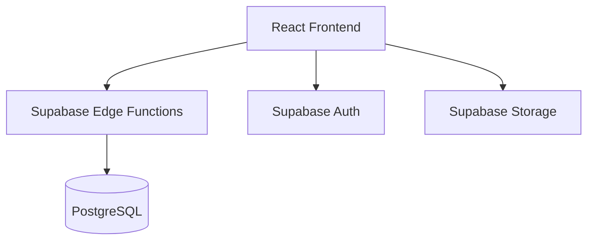

# Architecture

## 🛠 Tech Stack
- **Frontend**: React 18, Vite, Tailwind CSS 4, Radix UI.
- **Backend**: Supabase (PostgreSQL, Edge Functions, Auth).
- **Icons & Motion**: Lucide React, Framer Motion.
- **Charts**: Recharts.

## System Overview
MoneyFlow follows a classic Client-Server architecture where the frontend communicates with a backend-as-a-service (Supabase).

## 📂 Directory Structure
- `src/`: Frontend source code.
  - `app/`: Main application logic.
    - `pages/`: Route-level components.
    - `components/`: UI and layout building blocks.
    - `routes.tsx`: Navigation configuration.
  - `contexts/`: Global state (Auth).
  - `utils/`: Helpers and API client.
- `supabase/`: Backend logic and configurations.
  - `functions/`: Edge functions (Deno/TypeScript).
- `public/`: Static assets.

## Frontend Structure
The application is organized into a modular structure under `src/app/`:

- **Pages (`src/app/pages/`)**: Main entry points for each route (Dashboard, Wallets, etc.).
- **Components (`src/app/components/`)**:
  - `ui/`: Low-level, reusable UI components (Buttons, Inputs, Modals).
  - `Layout.tsx`: The main application shell including navigation.
- **Contexts (`src/contexts/`)**: Global state management (Authentication).
- **Utils (`src/utils/`)**:
  - `api.ts`: Centralized API client using `fetch`.
  - `supabase/`: Configuration and helper functions for Supabase integration.

## Backend Structure
- **Edge Functions (`supabase/functions/`)**: Server-side logic for business rules, hosted on Supabase.
- **KV Store**: Utilized for lightweight state storage where needed.

## Key Design Patterns
1. **Protected Routes**: Navigation is guarded by authentication state stored in `localStorage` and managed via `AuthContext`.
2. **Atomic UI**: UI components are built using Radix UI primitives and styled with Tailwind CSS for high reusability.
3. **API Wrapper**: A centralized `ApiClient` class handles headers, authentication tokens, and standardized error handling.
